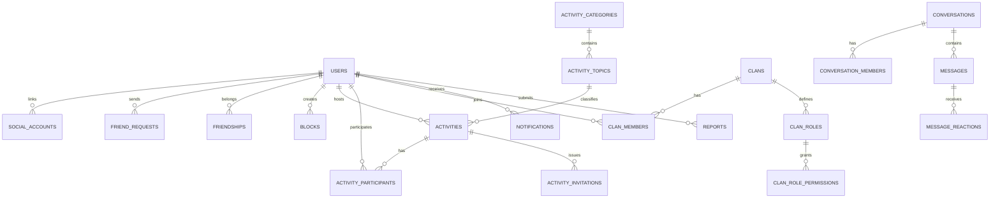

# Database architecture and ERD

PostgreSQL 16 is the system of record. Timestamps use UTC and APIs serialize
ISO-8601. Public identifiers are UUIDs. User-owned content uses soft deletion
where recovery or moderation history matters.

## Domain ERD

## Integrity rules

- Usernames and verified email addresses are case-insensitively unique.
- A normalized unordered user pair is unique for friendships and blocks.
- One active friend request is allowed per unordered pair.
- `(activity_id, user_id)` is unique for participation history.
- Capacity changes and joins run in a transaction with a row lock on activity.
- `(clan_id, user_id)` is unique for clan membership history.
- Role names are unique within a clan; permissions use stable string keys.
- Invitation token hashes and invitation codes are globally unique.
- Message membership is checked against the conversation before every write.
- Audit records are append-only and unavailable for deletion in normal admin UI.

## Initial Phase 1 tables

`users`, `social_accounts`, `personal_access_tokens`, `password_reset_tokens`,
`sessions`, `jobs`, `job_batches`, `failed_jobs` and `audit_logs`.

Later tables are introduced by their owning vertical slice, not up front.

